  
   
  

# Fedoraware

A free and open-source training software for Team Fortress 2, based on [SE-Owned](https://www.unknowncheats.me/forum/team-fortress-2-a/436430-seowned-featured-cheat.html).

## Notes

- It is required to use [dxlevel 90](https://docs.mastercomfig.com/latest/customization/launch_options/?h=#dxlevel-launch-options) or higher.
- You might have issues with injecting if you are on Windows 10 upgraded from Windows 7.
- The source code is most likely **DETECTED**, use [VAC Bypass by danielkrupinski](https://github.com/Fedoraware/VAC-Bypass-Loader/releases/tag/Release). In the event you get VAC banned, we are not responsible. Don't cheat on accounts you care about.
- Read the [Fedoraware Documentation](https://fedoraware.github.io/Docs/) to learn more about Fedoraware and its features.
- If you want to use Discord RPC, you need to download [discord-rpc.dll](https://github.com/Fedoraware/discord-rpc/releases/latest/) into your game folder.

## Guide

- We suggest using [Fedoraloader](https://github.com/Fedoraware/Fedoraloader/releases) as it downloads the latest build and injects it with minimal crashing. It also includes a VAC bypass.
- Alternatively, use an injector like [Xenos](https://github.com/DarthTon/Xenos/releases) to inject the dll into TF2. [(Tutorial)](https://www.youtube.com/watch?v=PT3kVA053IY)
- **If you have any suggestions for the cheat, or questions about it, you can open a thread in [discussions](https://github.com/Fedoraware/Fedoraware/discussions).**
- **If you have any problems, you can open an [issue](https://github.com/Fedoraware/Fedoraware/issues).**

## Media

- [Fedoraware is the best free cheat in tf2 (by bean)](https://www.youtube.com/watch?v=FyeaMghYZL0)
- [Playing as Michael Jackson (by km)](https://www.youtube.com/watch?v=cVD3BBEMNPo)

## Credits to

- [spook953](https://github.com/spook953)
- [Lak3](https://github.com/Lak3)
- [Baan](https://github.com/xxmyn)
- [lnx00](https://github.com/lnx00)
- [Johnathon Walnut](https://github.com/johnathon-walnut)
- [JAGNEmk](https://github.com/JAGNEmk)
- [r00t](https://github.com/l-r00t-l)
- [lykanfox](https://github.com/lykanfox)
- ...and all other [contributors](/../../graphs/contributors)!
